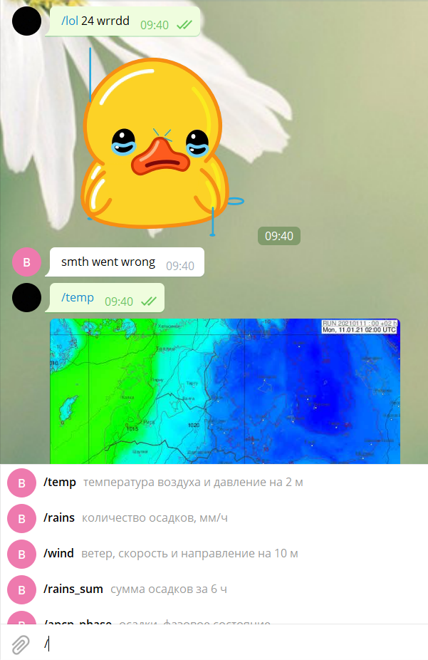
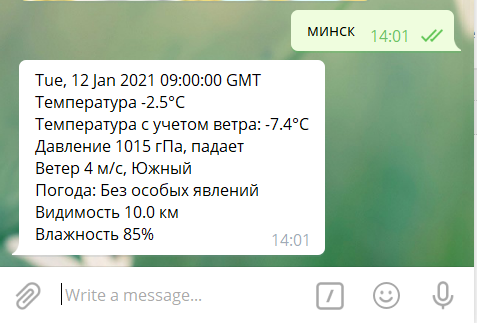
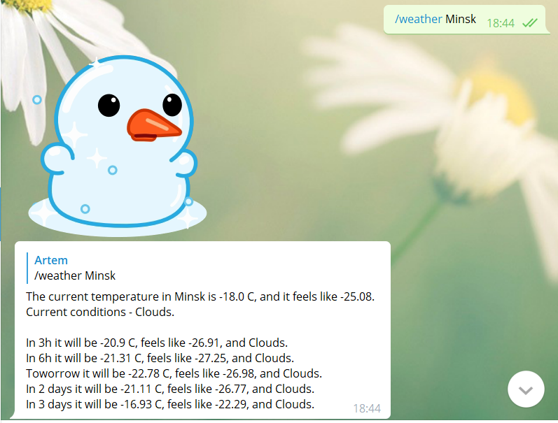

### WeatherBot
WeatherBot может показывать различные погодные карты полученные при моделировании погоды Белгидрометом. Доступные модели: WRF3, GFS, UKMET и GEM.
Пример использовани: /cmd xxx model_name, где: 
- cmd - комманда (тип погодной карты)
- xxx - число между 2 и 120 (ч). Для различных моделей и комманд доступны разные временные интервалы.
- model_name - модель ('wrf', 'wrf3'), ('egrr', 'ukmet'), ('gfs', 'ncep'), ('gem', 'cmc') или ('avia', 'fact') (синонимы даны в скобках).

#### All available commands
##### WRF3, GEM, UKMET, GFS commands
- temp - температура воздуха и давление на 2 м
- rains - количество осадков, мм/ч
- wind - ветер, скорость и направление на 10 м
- rains_sum - сумма осадков за 6 ч
- apcp_phase - осадки, фазовое состояние
- fog - туман и осадки
- snow - снежный покров, высота
- xrefd - радиолокационная отражаемость, метеоявления
- xrefd_mx - радиолокационная отражаемость, максимальная
- ot-500-1000 - OT500-1000
- cape_ukr - энергия неустойчивости CAPE
- cape_180 - энергия неустойчивости CAPE180
- tmp925 - высота геопотенциала, ветер и температура на 925 гПа
- tmp850 - высота геопотенциала, ветер и температура на 850 гПа
- tmp700 - высота геопотенциала, ветер и температура на 700 гПа
- tmp500 - высота геопотенциала, ветер и температура на 500 гПа
- tmp300 - высота геопотенциала, ветер и температура на 300 гПа
- k_index - К индекс (вероятность грозы)
##### AVIA commands
- vis - Карта дальности метеорологической видимости по данным аэропортов, Европа
- cloud - Карта высоты нижней границы облаков по данным метеостанций аэропортов, Европа

### Получение фактической погоды в разных городах
Для получения фактической погоды, наберите название города на русском языке в любом регистре.

[Список доступных городов.](https://www.pogoda.by/rss2/)

### Получение прогноза погоды на 3 дня
Для получения фактической погоды, наберите /weather <cityname>, например /weather Toronto. Без указания города юудет показан прогноз погоды в Миснке.
Данные берутся из [OpenWeatherMap](https://openweathermap.org/).

Все погодные карты и актические погодные данные предоставлены Белгидрометом - [POGODA.BY](https://www.pogoda.by/).